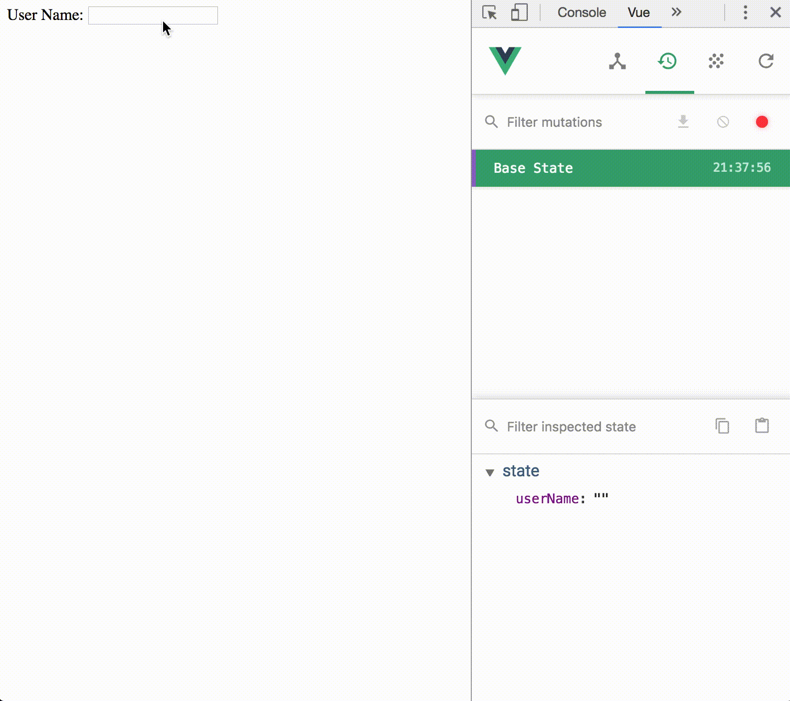

# vuex-model-helper

<a target="_blank" href="https://travis-ci.org/LiaoJimmy/vuex-model-helper">
  
</a>

> Help you use vuex and v-model more happier

## Installation
``` bash
yarn add vuex-model-helper
# or by npm
npm install --save vuex-model-helper
```

## How to use vuex-model-helper
1. Use ```mutationGenerator()``` to generate your v-model mutations
``` javascript
import Vuex from 'vuex';
import { mutationGenerator } from 'vuex-model-helper';

const mutations = {
  ...mutationGenerator([
    'userName',
  ]),
};
const state = {
  userName: '',
};
const store = new Vuex.Store({
  mutations,
  state,
});
```

2. In your *.vue file, call ```computedGenerator()``` and ```methodsGenerator()``` to generate computed object and mutation methods.
``` html
<template>
  <div>
    User Name:
    <input
      type="text"
      v-model="userName"
    >
  </div>
</template>

<script>
import { mapMutations } from 'vuex';
import {
  computedGenerator,
  methodsGenerator,
} from 'vuex-model-helper';

export default {
  computed: {
    ...computedGenerator([
      'userName',
    ]),
  },
  methods: {
    ...mapMutations([
      ...methodsGenerator([
        'userName',
      ]),
    ]),
  },
};
</script>
```

3. And then you can "change" your v-model and then trigger your mutation (CHANGE_USER_NAME).


## More example
- [More HTML ```<input/>``` element](https://github.com/LiaoJimmy/vuex-model-helper/blob/master/example/src/components/Example.vue)
- [Todo List with Element-UI](https://github.com/LiaoJimmy/todo-list)
